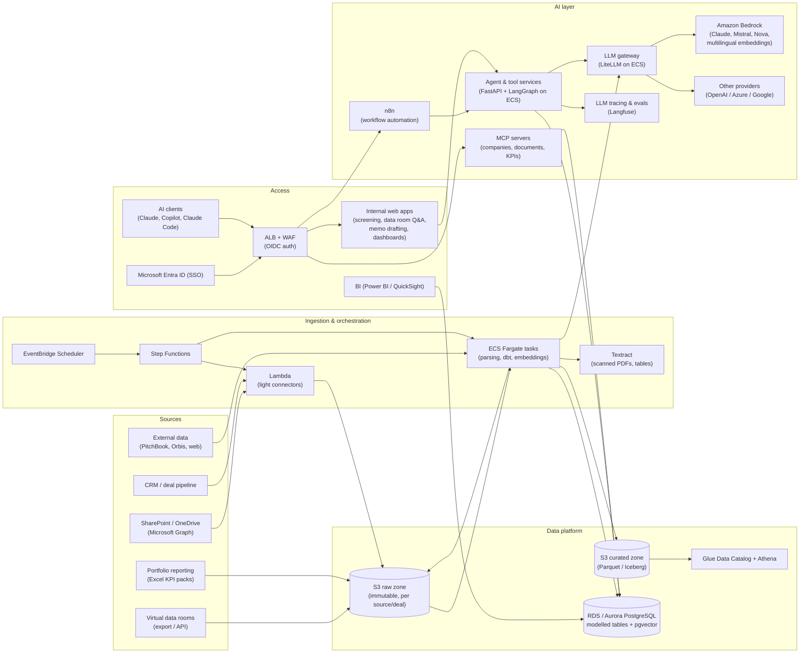
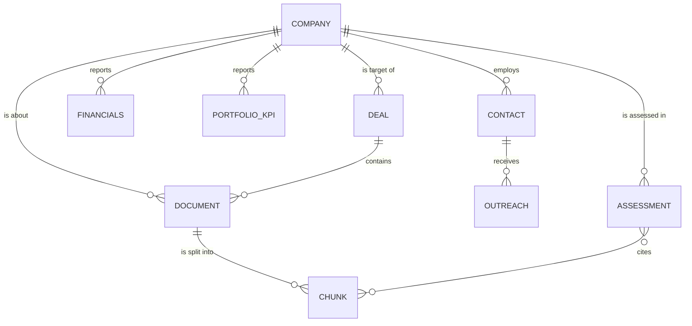
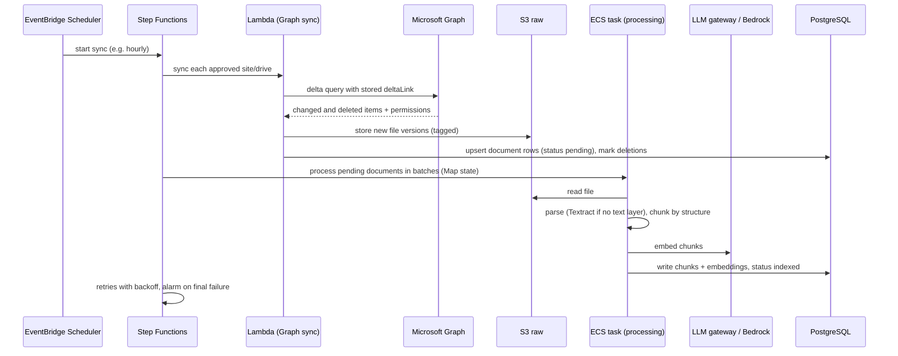
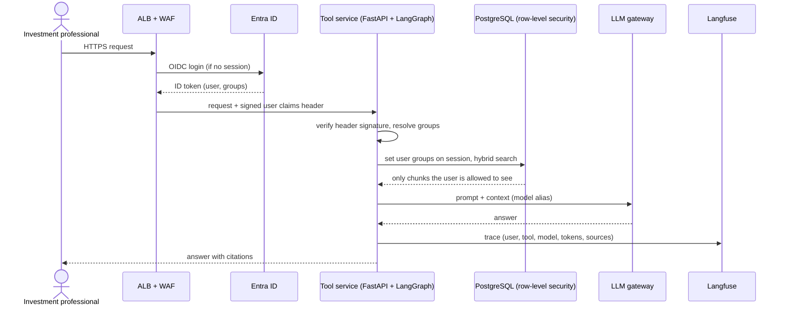
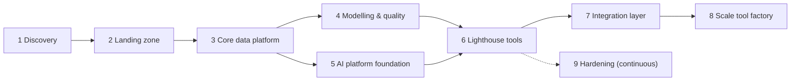

# AWS Target Architecture – BU Partners Data & AI Platform

Target architecture for the firm-wide data platform and internal AI "tool factory" described in the Candidate Briefing Pack, with AWS as the chosen cloud. The deal screening copilot in this repository is one of the first tools that runs on it.

## Starting point and design constraints

| Briefing pack fact | Architectural consequence |
|---|---|
| ~100 people, ~50 on the investment team | Data volumes are GBs, not TBs. No big-data stack (Redshift, EMR, Databricks) is needed. |
| Files live on SharePoint/OneDrive, no warehouse | The first pipelines pull from Microsoft Graph. Microsoft Entra ID remains the identity source. |
| Simple, maintainable tooling, easy handover | Managed/serverless services, one database engine, Terraform, containers. No Kubernetes. |
| Model-agnostic, no lock-in to one AI vendor | All LLM calls go through one gateway. Data and context are exposed via APIs/MCP, not tied to one tool. |
| Data rooms, portfolio reporting, existing systems | Several ingestion paths (API pull, upload, email/file drop) land in one raw zone. |
| Python backend + DB + light HTML/JS, MCP servers, n8n/Make | ECS Fargate services, PostgreSQL, a self-hosted n8n, MCP servers behind SSO. |
| No CTO/CIO, small team on call for what it builds | Few moving parts, central logging/alerting, runbooks, infrastructure as code. |
| Offices in Zug, Munich, Milan, Amsterdam, London | EU region for data residency, SSO-protected HTTPS access from anywhere (no office VPN required). |

## Target architecture



Cross-cutting (not drawn): IAM Identity Center, KMS, Secrets Manager, CloudTrail, GuardDuty, Security Hub, AWS Config, CloudWatch, AWS Budgets, ECR, Terraform, GitHub Actions.

### Which service is used by what

| Area | AWS service | Used by / for |
|---|---|---|
| **Accounts & identity** | AWS Organizations | Separate `management`, `log-archive/security`, `dev`, `prod` accounts. Blast-radius and cost separation. |
| | IAM Identity Center (federated with Entra ID) | Engineers' console/CLI access with existing Microsoft credentials. No IAM users. |
| | ALB `authenticate-oidc` against Entra ID | SSO for every internal web app, MCP server and n8n. Entra groups map to deal teams and roles. |
| **Network** | VPC (2 AZs), private subnets, S3 gateway endpoint, Bedrock/Secrets Manager interface endpoints | Databases and services are never publicly reachable. Bedrock traffic stays on the AWS network. |
| | ALB + AWS WAF + ACM | The single HTTPS entry point (managed rules, rate limiting, optional office-IP allow-list). |
| **Ingestion** | EventBridge Scheduler | Nightly/hourly triggers (SharePoint delta sync, CRM sync, KPI loads, re-embedding). |
| | Step Functions | Pipeline orchestration with retries, branching and visible run history. A lightweight alternative to Airflow. |
| | Lambda | Light API connectors (Microsoft Graph delta queries, CRM API, S3 event handlers). |
| | ECS Fargate (tasks) | Heavy jobs: document parsing, chunking, embedding, web scraping, `dbt run`. |
| | Amazon Textract | OCR and table extraction for scanned data room PDFs and financial statements. |
| | S3 presigned uploads / AWS Transfer Family (SFTP, optional) | Data room exports and portfolio-company KPI packs that have no API. |
| **Storage & modelling** | S3 raw zone (versioning, KMS, Object Lock optional) | Immutable copy of every ingested file, with prefixes per source and per deal. |
| | S3 curated zone (Parquet / Apache Iceberg) | Cleaned, typed datasets (financials, KPIs, company master) in an open format. |
| | Glue Data Catalog + Athena | Ad-hoc SQL over S3, audits, back-fills. Pay per query, no servers. |
| | RDS PostgreSQL or Aurora PostgreSQL Serverless v2 + pgvector | Central "small warehouse" and app database: company master, deals, documents, chunks + embeddings, portfolio KPIs, tool state. Modelled with dbt. |
| **AI** | Amazon Bedrock | Default LLM and embedding provider inside AWS and the EU (EU cross-region inference profiles). Multilingual embeddings (e.g. Cohere Embed Multilingual, Titan v2) for German + English documents. |
| | LLM gateway (LiteLLM proxy on ECS Fargate) | One OpenAI-compatible endpoint for all tools. Routes to Bedrock or other providers, with per-tool keys, budgets, fallbacks and usage logs. This keeps the platform model-agnostic. |
| | ECS Fargate (services) | Agent/tool backends (FastAPI + LangGraph, e.g. this screening copilot), internal UIs, MCP servers, n8n, Langfuse. |
| | MCP servers | Expose curated data ("find comparable companies", "search deal documents", "get portfolio KPIs") to Claude, Copilot, Claude Code and in-house agents, with the same Entra-based permissions. |
| | n8n (self-hosted, Postgres backend) | Workflow automation built close to the business: outreach sequences, alerts, intake forms, scheduled reports. |
| | Langfuse (self-hosted or EU cloud) | Prompt/trace logging, cost per tool, evaluation datasets (golden questions), prompt versioning. |
| **Delivery** | ECR, GitHub Actions (OIDC to AWS), Terraform | Container builds, automated tests, plan/apply per environment. No long-lived AWS keys. |
| **Security & ops** | KMS, Secrets Manager | Encryption at rest everywhere. API keys and DB credentials with rotation. |
| | CloudTrail (org trail), GuardDuty, Security Hub, AWS Config, Macie (optional) | Audit trail, threat detection, configuration drift, PII discovery in S3. |
| | CloudWatch (logs, metrics, alarms) + SNS → Teams/e-mail | Pipeline failures, error rates, latency, DB health. On-call alerting for the team. |
| | AWS Backup, RDS PITR, S3 replication within the EU | Backups and disaster recovery. |
| | AWS Budgets + Cost Explorer + tags (`tool`, `env`, `owner`) | Cost per tool and per environment. Alerts before overspend. |

### Data model backbone

The value of every later tool depends on a small number of well-modelled core entities in PostgreSQL:

| Entity | Content | Main sources |
|---|---|---|
| `company` | Canonical ID, name variants, domain, register number, sector, country | CRM, external data, documents (entity resolution) |
| `deal` | Company, stage, deal team, dates, outcome, NDA/retention terms | CRM, deal pipeline |
| `document` / `chunk` | File metadata, source, deal, access group, text chunks, embeddings | SharePoint, data rooms, web |
| `financials` / `portfolio_kpi` | Company, period, metric, value, currency, source document | Data room financials, portfolio KPI packs |
| `contact` / `outreach` | People, companies, interaction history, opt-out status | CRM, n8n outreach workflows |
| `assessment` | Tool outputs (e.g. screening results) with sources, model, prompt version | AI tools (this repo's `data/analysis` cache becomes a table) |



Columns that every tool relies on:

| Table | Key columns |
|---|---|
| `document` | `id`, `source` (sharepoint/dataroom/web/...), `source_id` + `source_version`, `s3_uri`, `company_id`, `deal_id`, `doc_type`, `language`, `access_group`, `classification`, `retention_until`, `status` (pending/indexed/failed/purged), `content_hash` |
| `chunk` | `id`, `document_id`, `ordinal`, `heading_path`, `page`, `text`, `tsv` (full-text vector), `embedding`, `embedding_model`, `access_group`, `deal_id` |
| `financials` / `portfolio_kpi` | `company_id`, `period_end`, `period_type` (month/quarter/year, actual/budget/forecast), `metric`, `value`, `currency`, `source_document_id`, `loaded_at` |
| `assessment` | `tool`, `company_id`, `criterion`, `result` (JSON), `model`, `prompt_version`, `corpus_fingerprint`, `created_by`, `created_at` |

`embedding_model` is stored per chunk so a provider/model switch can re-embed side by side and cut over without downtime – the gap this repo hit when switching between MiniLM and Google embeddings.

Layers follow a simple `raw → staging → core → marts` dbt convention. Data quality checks (dbt tests: uniqueness, not-null, accepted values, freshness, row-count anomalies) run in every pipeline and fail it on errors.

### Account and network layout

| Account | Purpose | Contents |
|---|---|---|
| `management` | Billing, Organizations, SCPs, IAM Identity Center | No workloads |
| `security` / `log-archive` | Central audit | Org CloudTrail bucket, Config aggregator, GuardDuty/Security Hub delegated admin |
| `dev` | Development and tests | Same Terraform modules as prod, smaller sizes, synthetic/public data only |
| `prod` | Real deal and portfolio data | All production workloads |

Network per workload account (one VPC, 2 Availability Zones):

| Subnet tier | Contains | Inbound allowed from |
|---|---|---|
| Public | ALB, NAT Gateway | Internet on 443 only, via WAF |
| Private – app | ECS services and tasks, VPC-attached Lambdas, interface endpoints | ALB security group (service ports), other app components |
| Private – data | RDS PostgreSQL, Langfuse's ClickHouse/Redis | App security group only (e.g. 5432) |

Egress: AWS APIs via VPC endpoints (S3 gateway; Bedrock runtime, Secrets Manager, ECR, CloudWatch Logs, STS as interface endpoints). Internet egress (Microsoft Graph, CRM APIs, external data providers, non-AWS LLM providers) via NAT – one NAT in dev, one per AZ in prod.

### S3 layout

```text
s3://bu-data-raw-prod/
  sharepoint/<site-id>/<drive-id>/<item-id>/<version>/<filename>
  dataroom/<deal-id>/<upload-batch>/<original-path>
  portfolio-reporting/<company-id>/<period>/<filename>
  crm/<entity>/<extract-date>/part-*.json
  web/<company-id>/<crawl-date>/...
s3://bu-data-curated-prod/
  documents_text/<document-id>.json      # parsed text + structure
  financials/                             # Iceberg table
  portfolio_kpi/                          # Iceberg table
s3://bu-artifacts-prod/
  exports/<tool>/<user>/...               # generated memos, Excel, PPT
  evals/<tool>/<run-id>/...               # evaluation reports
```

Every object carries tags `deal_id`, `classification` and `retention_until`. Lifecycle rules move old raw versions to cheaper storage classes. Bucket policies deny unencrypted uploads and any non-TLS access.

### Key flows

**1. Document ingestion (SharePoint example)**



Details that matter in practice:
- The Entra app uses `Sites.Selected` – an admin grants access per approved site. No tenant-wide `Sites.Read.All`.
- Delta links are stored per drive, so each run only fetches changes. Deleted or moved files are propagated (document marked purged, chunks removed).
- SharePoint permissions are read alongside files and mapped to `access_group`. A file is only indexed if its permissions map to a known group; otherwise it is quarantined for review.
- Parsing by type: PDF (text layer first, Textract fallback), Word, PowerPoint, e-mail (`.msg`/`.eml`). Excel files are loaded as tables, not text chunks.
- `content_hash` skips re-processing of unchanged files. Each document commits independently, so a failure never discards progress on other documents (a lesson from this repo's bulk ingestion).

**2. User request to an AI tool**



The ALB passes user claims in the `x-amzn-oidc-data` header as a signed JWT. Services verify the signature against the ALB's regional public key endpoint and only accept traffic from the ALB security group.

**3. Deal lifecycle and data room handling**

1. Deal is created in the CRM → sync creates a `deal` row, a deal code, an Entra group `aip-deal-<code>` (deal team members) and a default retention date.
2. Data room content is synced via provider API or uploaded as an export (presigned S3 upload in the data room tool) into `dataroom/<deal-id>/`.
3. Ingestion indexes it with `access_group = aip-deal-<code>`.
4. Deal team uses Q&A, red-flag scans and screening on the deal's documents only.
5. Deal lost/withdrawn → purge job deletes S3 objects (all versions), `document`/`chunk`/`assessment` rows, exports and LLM traces tagged with the deal, and writes a deletion record (what, when, who) for the NDA file. Deal won → content moves under portfolio retention rules.

### Access control model

| Entra group | Grants |
|---|---|
| `aip-users` | Access to the platform and to non-confidential data (public/web corpus, company master) |
| `aip-deal-<code>` | Documents, assessments and Q&A for one deal |
| `aip-portfolio` | Portfolio KPIs and portfolio company documents |
| `aip-ir` | Investor reporting data |
| `aip-admins` | n8n editor, Langfuse, admin views |
| `aip-engineers` | AWS access via IAM Identity Center permission sets (`ReadOnly` in prod by default, deploys only via CI/CD) |

Row-level security in PostgreSQL is the hard enforcement layer, independent of application code:

```sql
ALTER TABLE chunk ENABLE ROW LEVEL SECURITY;
CREATE POLICY chunk_by_group ON chunk
  USING (access_group = ANY (string_to_array(current_setting('app.user_groups', true), ',')));
```

Services connect with a non-owner database role (table owners bypass RLS unless `FORCE ROW LEVEL SECURITY` is set). Automated tests assert that a user without `aip-deal-x` gets zero results for deal X across every tool and MCP server.

### Retrieval and LLM gateway

Retrieval (shared library used by all tools and MCP servers):
- Hybrid search: pgvector similarity + PostgreSQL full-text search (German and English configurations), merged with reciprocal rank fusion. Exact terms such as company names, product names and KPI labels are found reliably by full-text, meaning by vectors.
- Optional reranking (e.g. a Cohere Rerank model on Bedrock) on the merged top results.
- Metadata filters: company, deal, document type, date range, language.
- Distance cutoff and "insufficient evidence" short-circuit, as already implemented in this repo.

The gateway exposes model aliases instead of vendor model IDs, so a model change is a configuration change, not a code change:

| Alias | Used for | Example mapping (changes over time) |
|---|---|---|
| `default-chat` | Q&A, screening, comparisons | Claude Sonnet-class model on Bedrock (EU inference profile) |
| `fast-cheap` | Classification, extraction, routing, metadata tagging | Small model (e.g. Claude Haiku-class, Amazon Nova Lite, Mistral small) |
| `long-context` | Full-document analysis, memo drafting | Large-context model on Bedrock |
| `embed-multilingual` | Document and query embeddings | Cohere Embed Multilingual or Titan Text Embeddings v2 on Bedrock |

Each tool gets its own virtual key with a monthly budget, rate limit and allowed aliases. Fallbacks (e.g. secondary model on throttling) are configured centrally.

### MCP servers and n8n

- MCP servers run as remote servers (Streamable HTTP) on ECS behind the ALB. Authentication uses OAuth with Entra ID, so the same groups and row-level security apply as in the web tools.
- Initial MCP tools are read-only: `search_documents`, `get_company_profile`, `find_similar_companies`, `get_portfolio_kpis`, `get_deal_status`. Write actions (e.g. creating CRM notes) come later, with explicit confirmation.
- Every MCP call is logged (user, tool, parameters, result size) to CloudWatch for audit.
- n8n runs with PostgreSQL as its database, behind SSO, with credentials stored in n8n's encrypted store (encryption key in Secrets Manager). LLM calls from n8n go through the gateway like any other tool. Production workflows are exported to git.

### Initial sizing

| Component | Dev | Prod |
|---|---|---|
| PostgreSQL | db.t4g.medium, single-AZ | db.m7g.large Multi-AZ (or Aurora Serverless v2), 100 GB gp3 |
| Tool services, MCP servers | 0.5 vCPU / 1 GB, 1 task each | 0.5–1 vCPU / 1–2 GB, 2 tasks across AZs |
| LLM gateway | 0.5 vCPU / 1 GB, 1 task | 0.5–1 vCPU / 1–2 GB, 2 tasks |
| n8n | 0.5 vCPU / 1 GB | 1 vCPU / 2 GB, 1 task (queue mode once workflows grow) |
| Langfuse | Langfuse Cloud (EU) or 1 small task | Web + worker tasks, ClickHouse, small ElastiCache Redis |
| Processing tasks | On demand, 1–4 vCPU / 4–8 GB | Same, parallelism set by Step Functions Map concurrency |
| NAT Gateway | 1 | 2 (one per AZ) |

Sizes are starting points. CloudWatch metrics drive adjustments after the first months of real usage.

### Repositories and delivery

| Repository | Content |
|---|---|
| `platform-infra` | Terraform: organization, accounts, network, shared services (RDS, ALB, gateway, n8n, Langfuse) |
| `data-pipelines` | Connectors (Lambda/ECS), Step Functions definitions, dbt project, data quality tests |
| `ai-tools` | Shared Python package (auth, retrieval, gateway client, tracing), one folder per tool, the tool template, evaluation sets |
| `context` (or a folder in `ai-tools`) | Prompts, screening frameworks, memo templates, golden questions – the versioned business knowledge |

Delivery pipeline per change: pull request → lint, unit tests, evaluation run, `terraform plan` posted to the PR → merge → image built and pushed to ECR → deploy to dev → manual approval → deploy to prod. Every tool ships with a README covering business context, data used, owner, and runbook.

## Implementation order

Each phase ends with something usable. Foundations come first, as the briefing pack requires, but a first visible tool ships early to build trust and adoption. With two founding hires, phases 4 (data-leaning) and 5 (AI-leaning) run in parallel.



### 1. Discovery and prioritisation

**Goal:** understand real workflows and data before building anything.

- Interview investment team members (across seniority levels and verticals), value creation, finance/IR, compliance and IT. Shadow concrete tasks: a first screening, a data room first pass, an outreach campaign, a quarterly KPI collection.
- Map the existing ad-hoc AI tools (enterprise AI tools, the PE-specific AI platform, personal scripts): who uses what, for which data, with what results.
- Inventory SharePoint/OneDrive: sites, folder conventions per deal/portfolio company, file types and volumes, permission structure, duplicates, naming quality.
- Inventory other systems: CRM/deal pipeline, data room providers in use, portfolio reporting process, fund administration, external data subscriptions (and their API/licence terms).
- Classify data (public / internal / confidential deal data / personal data). Collect NDA and data room terms (storage location, retention, deletion obligations, AI processing restrictions).
- Score the use-case backlog (see *Use-case prioritisation* below) and select 1–2 lighthouse use cases with a named business owner.
- Agree on region, data residency and the compliance frame with compliance/DPO.

**Deliverables:** current-state map, data inventory, data classification, prioritised backlog, lighthouse selection, target architecture (this document) reviewed with the external technical advisor.
**Done when:** the senior sponsor signs off on the lighthouse use cases and the architecture direction.

### 2. AWS landing zone

**Goal:** a secure, auditable, reproducible AWS foundation.

- AWS Organizations with `management`, `security/log-archive`, `dev`, `prod` accounts. SCPs: EU regions only, deny disabling CloudTrail/GuardDuty, deny root user actions.
- IAM Identity Center federated with Entra ID (SAML + SCIM provisioning). MFA and conditional access enforced by Entra. Permission sets: `Admin` (break-glass, monitored), `PowerUser` (dev), `ReadOnly` (prod).
- Org-wide CloudTrail to the log archive, GuardDuty, Security Hub (AWS Foundational Security Best Practices), AWS Config, IAM Access Analyzer.
- AWS Budgets per account with alerts to e-mail/Teams. Mandatory tags enforced via tag policies.
- Terraform repository with remote state (S3 with native state locking), reusable modules, `dev`/`prod` workspaces or directories.
- GitHub Actions with OIDC roles per account (plan on PR, apply on merge).
- VPC baseline (see *Account and network layout*), Route 53 subdomain (e.g. `ai.<firm-domain>`), ACM certificate, ALB + WAF, Entra app registration for ALB OIDC.

**Deliverables:** accounts, identity, network and security baseline, all in Terraform.
**Done when:** an engineer logs in via Entra, a "hello world" container is reachable only after SSO login, and Security Hub shows no critical findings.

### 3. Core data platform

**Goal:** reliable, incremental ingestion of the most important source into a governed store.

- S3 raw, curated and artifacts buckets with KMS, versioning, block public access, lifecycle rules and the prefix/tag convention.
- RDS/Aurora PostgreSQL with pgvector, private subnets, IAM/Secrets Manager credentials, automated backups. Schema migrations with Alembic.
- Core tables: `company`, `deal`, `document`, `chunk` with access and retention columns from day one.
- SharePoint/OneDrive connector via Microsoft Graph delta queries, with permission mapping and quarantine for unmapped files.
- Document processing task: parsing, Textract fallback, structure-aware chunking.
- Step Functions + EventBridge Scheduler, CloudWatch alarms on failed executions, a simple "pipeline health" dashboard.

**Deliverables:** priority SharePoint sites ingested and kept in sync, documents searchable by metadata.
**Done when:** a new file in an approved site appears in `document` within one sync cycle, deletions propagate, and a failed run raises an alert.

### 4. Modelling and data quality

**Goal:** a trusted, structured backbone beyond documents.

- Company master with entity resolution (web domain, commercial register number, fuzzy name matching with manual review queue) – the join key for everything else.
- CRM/deal pipeline sync → `deal`, `contact`, deal team membership → Entra deal groups.
- Portfolio KPI ingestion: agree a standard reporting template with portfolio companies, load Excel packs (upload or e-mail drop) → `portfolio_kpi`. Validation rules (missing periods, unit/currency mismatches, implausible jumps) produce an exception report to the deal team.
- Financials extraction from data room documents into `financials` (structured extraction with the `fast-cheap` model + validation against totals, human review for low-confidence values).
- dbt models (`staging` → `core` → `marts`) with tests and documentation (`dbt docs`).
- First BI dashboard on portfolio KPIs for finance/IR and deal teams.

**Deliverables:** company master, deal and KPI tables, data quality reports, first dashboard.
**Done when:** portfolio KPIs for all portfolio companies load automatically for one reporting cycle, and dbt tests pass.

### 5. AI platform foundation

**Goal:** shared, governed AI building blocks so every tool does not reinvent them.

- Enable required Bedrock models (EU inference profiles). Deploy the LLM gateway with model aliases, per-tool virtual keys and budgets.
- Embedding pipeline with `embed-multilingual` into pgvector, including `embedding_model` versioning.
- Shared retrieval library: hybrid search, optional reranking, metadata filters, row-level security.
- Langfuse for tracing and cost per tool. Evaluation harness with golden questions per tool, runnable locally and in CI.
- Tool template (FastAPI + LangGraph + simple HTML/Streamlit UI + Terraform module + tests + README + runbook) – the "tool factory" blueprint.
- AI usage policy draft with compliance (which tools for which data classes).

**Deliverables:** gateway, retrieval library, tracing, eval harness, tool template.
**Done when:** a new tool can be created from the template and deployed to dev with SSO, retrieval and tracing working, without writing infrastructure code.

### 6. Lighthouse tools

**Goal:** first visible value for the investment team on top of the platform.

- **Deal screening copilot (this repo)** moved onto the platform:

  | Current prototype | On the platform |
  |---|---|
  | Single EC2 host, public IP, no auth | ECS Fargate behind ALB with Entra SSO |
  | RDS reachable by the instance only | Private RDS shared platform database with row-level security |
  | Groq / Google via provider SDKs | LLM gateway aliases (Bedrock by default) |
  | Local MiniLM embeddings (English-centric) | Multilingual Bedrock embeddings (requires re-ingestion) |
  | Website/report corpus from `config/sources.yaml` | Web corpus + SharePoint + data room documents per company/deal |
  | Results cached as JSON in `data/analysis/` | `assessment` table with model, prompt version and sources |
  | Screening criteria in YAML in the repo | Criteria in the versioned `context` repository, owned with the investment team |

- **Data room Q&A and red-flag scan:** per-deal space, sync or upload, questions with citations, standard red-flag checklist (change of control clauses, customer concentration, litigation, key-person dependencies), purge at deal end.
- Rollout: one champion per lighthouse in the investment team, demos at desks, short feedback loop, usage and time-saved measurement from day one.

**Deliverables:** two tools in production use.
**Done when:** the tools are used weekly by the target deal teams, and the business owner confirms measurable time savings.

### 7. Integration layer

**Goal:** bring the firm's context to wherever people already work.

- MCP servers on the curated data (see *MCP servers and n8n*), connected to the approved AI clients.
- n8n for business-near automation, e.g. personalised outreach at scale: CRM target list → company profile from the platform → LLM draft via gateway → human review and edit → send → log in CRM, with opt-out handling.
- Notifications to Teams (pipeline issues, portfolio KPI exceptions, new screening results).
- Exports to Office formats (Excel tables, Word memo drafts, PowerPoint one-pagers) into SharePoint.

**Deliverables:** MCP servers in use, first n8n workflows in production.
**Done when:** investment professionals use the firm's data from their AI client of choice with the same permissions as in the web tools.

### 8. Scale the tool factory

**Goal:** a repeatable process to turn requests into maintained tools.

- Intake: short request form (problem, users, frequency, data needed, expected value) → scoring → backlog → regular prioritisation with the senior sponsor.
- Further use cases from the briefing pack: IC memo/paper drafting, financial model support (Excel in/out), quarterly valuation support, portfolio monitoring alerts, investor reporting drafts.
- Tool lifecycle: experiment → pilot → production → retired, with clear criteria for each step (owner, evals, runbook, usage).
- Per-tool cost/usage dashboards. Adoption and efficiency KPIs reported to leadership.

**Deliverables:** intake process, tool catalogue, regular reporting.
**Done when:** new requests flow through the intake process and the tool catalogue shows owner, status and usage for every tool.

### 9. Hardening (continuous from phase 6)

- Multi-AZ for database and services, backups with tested restores, documented RTO/RPO (see *Backup and disaster recovery*).
- Runbooks per pipeline and tool, on-call alert routing, dependency and image scanning (ECR scanning, Dependabot), regular patching via image rebuilds.
- Periodic access reviews of Entra groups, IAM permission sets and MCP clients.
- Penetration test or external security review before broad rollout of confidential-data tools.
- Formal data and AI strategy document (a first-year success criterion in the briefing pack).

## Other considerations

### Confidentiality and access control
- **Need-to-know per deal.** Deal documents must only be visible to the deal team (and possibly not to other funds or portfolio-side teams). Enforce this in three places: S3 prefix/IAM policies, Postgres row-level security, and a mandatory access filter in retrieval. Never rely only on the LLM prompt.
- **NDA and data room terms.** Many NDAs require deletion of information when a process ends. Store deal ID and retention date on every object, chunk and embedding so a deal can be fully purged (S3, Postgres, vector rows, caches, LLM traces).
- **Personal data.** Outreach contacts, management team information and employee data in data rooms fall under GDPR / Swiss FADP. This needs a legal basis, an opt-out process, retention limits and records of processing.
- **LLM data handling.** Bedrock does not use inputs for training and keeps data in the selected region/inference profile. For any non-AWS provider behind the gateway, check data processing terms and zero-retention options before sending deal data.

### Regulation and governance
- **Region.** `eu-central-1` (Frankfurt) is the default (broadest service and Bedrock model coverage). `eu-central-2` (Zurich) is an option if Swiss data residency is required, but service and model availability there is narrower – check before committing.
- **Regulation.** As an alternative investment fund manager, the firm is likely in scope of EU DORA (ICT risk management, third-party register, incident reporting) and possibly FINMA requirements. Clarify with compliance early. AWS and LLM providers become registered ICT third parties.
- **EU AI Act.** Internal decision-support tools are typically not high-risk, but AI literacy obligations and transparency for generated content apply. Keep a register of AI tools in use.
- **Shadow AI.** An AI usage policy defines which tools are approved for which data classes. The new platform is the sanctioned path for confidential data.

### Architecture choices and trade-offs
- **Postgres-first instead of a separate warehouse.** At this firm's data volume one PostgreSQL instance covers the operational database, small warehouse and vector store. S3 + Athena/Iceberg keeps an open-format path for growth. Snowflake/Redshift/Databricks are only worth revisiting if volumes or BI concurrency grow substantially.
- **Avoid expensive "minimum footprint" services early.** MWAA (managed Airflow), OpenSearch Serverless and Redshift all have notable baseline monthly costs. Step Functions, pgvector and Athena cover the same needs at this scale.
- **Build vs. buy.** Managed RAG offerings (e.g. Bedrock Knowledge Bases with a SharePoint connector) are fast to start but give less control over chunking, metadata, access filters and evaluation. Owning the pipeline matches the firm's "build proprietary IP" strategy. Managed pieces can still be used where they are not differentiating.
- **Microsoft gravity.** The firm runs on Microsoft 365. Entra ID stays the identity provider, SharePoint stays the collaboration layer, and outputs go back to where people work: Excel/Word/PowerPoint exports, Teams notifications, possibly a Teams bot later. Microsoft 365 Copilot licences overlap with some use cases – position the platform as the source of firm-specific context (via MCP) rather than a competitor.
- **Power BI vs. QuickSight.** Power BI fits a Microsoft shop but needs a data gateway (e.g. on a small EC2 instance) to reach a private RDS. QuickSight is AWS-native but is a new tool for users.
- **Portability.** Terraform, containers, PostgreSQL, Parquet/Iceberg and an OpenAI-compatible gateway keep the stack movable between models, providers and, if ever needed, clouds.

### Quality, trust and adoption
- **Citations and human review.** Every AI output links to its source documents. IC memos, valuations and investor reports always have a named human reviewer. Outputs store model, prompt version and sources for auditability.
- **Evaluation.** Golden-question sets per tool, run in CI and after model changes. A model switch through the gateway is only rolled out after evals pass.
- **Context as IP.** Screening frameworks, memo templates, prompts and evaluation sets live versioned in git – these are the firm's institutional know-how and the real differentiator.
- **Adoption.** Ship small, demo in person, measure usage and time saved per tool, and retire tools nobody uses. Prioritisation is part of the job; the intake process protects the team from the expected flood of requests.

### Use-case prioritisation

Each request is scored 1–5 per criterion. High value with low data readiness usually means the data work comes first.

| Criterion | Question |
|---|---|
| Value | How many hours per month does it save, or how much does it improve deal outcomes? |
| Reach | How many people/deals use it, and how often? |
| Data readiness | Is the required data already on the platform, in good quality? |
| Feasibility | Can it be built with existing building blocks (retrieval, gateway, template)? |
| Risk | Confidentiality, regulatory exposure, impact of a wrong answer |
| Sponsorship | Is there a named business owner who will test, give feedback and champion it? |

Example first ranking from the briefing pack's use cases: data room Q&A and screening (high value, data available per deal), portfolio KPI collection (high reach, structured, low AI risk), outreach at scale (high value, needs CRM and company master first), IC memo drafting and valuations (high value but high risk of wrong numbers – after structured financials exist).

### Success measurement

| Briefing pack success criterion | Measurable KPIs |
|---|---|
| Working data foundation | Share of priority SharePoint sites ingested, pipeline success rate, data freshness, share of companies with a resolved master ID, dbt test pass rate |
| Adoption across the investment team | Weekly active users per tool, share of the investment team active, repeat usage, MCP calls per week |
| Measurable efficiency gains | Time per task before vs. after (first screening, data room first pass, KPI collection cycle, outreach letters per analyst) |
| Data and AI strategy within the first year | Strategy document approved, AI tool register and usage policy in place, roadmap agreed with leadership |

### Team and responsibilities

| Role | Responsibility |
|---|---|
| Senior sponsor (investment team) | Prioritisation, unblocking, adoption push, final say on the backlog |
| Data-leaning engineer | Landing zone, pipelines, modelling, data quality, BI |
| AI-leaning engineer | Gateway, retrieval, tools, MCP servers, evaluations, n8n |
| External technical advisor | Architecture and security reviews at key milestones |
| Use-case owners (per tool) | Requirements, golden questions, acceptance, champion role |
| IT / Microsoft 365 admin (internal or managed service provider) | Entra app registrations, Graph consents, group management |
| Compliance / DPO | Data classification, DPIA, DORA third-party register, AI usage policy |

### Risks and mitigations

| Risk | Mitigation |
|---|---|
| Inconsistent SharePoint structure and naming | Inventory in discovery, metadata conventions, folder templates for new deals, LLM-assisted classification of legacy files |
| Data leaking between deal teams | Three-layer enforcement (S3, RLS, retrieval), automated permission tests, periodic access reviews |
| Wrong numbers in memos or valuations | Numbers come from structured tables, not free LLM text; citations; named human sign-off |
| Flood of requests, no focus | Intake and scoring, sponsor-owned prioritisation, visible backlog |
| Low adoption | Champions per tool, desk demos, integration into Teams/Office/AI clients instead of yet another portal |
| Key-person risk in a small team | Infrastructure as code, one deployment pattern, docs and runbooks, advisor reviews |
| Model deprecations and provider changes | Gateway aliases, evaluations before switching, `embedding_model` versioning (this repo already hit deprecated Google models) |
| LLM cost overrun | Per-tool budgets, alerts, caching of assessments (as in this repo's analysis cache) |
| API limits (Microsoft Graph throttling, provider rate limits) | Delta sync, backoff and retries in Step Functions, concurrency limits per tool |

### Backup and disaster recovery

| Component | Protection | Target RPO | Recovery |
|---|---|---|---|
| PostgreSQL | Automated backups + point-in-time recovery, AWS Backup copy to a second EU region | Minutes | Restore from snapshot/PITR |
| S3 raw zone | Versioning, replication to a second EU region | Minutes | Read from replica |
| Chunks and embeddings | Derived data | – | Re-run processing from S3 raw |
| Infrastructure | Terraform | – | Re-apply modules |
| Prompts, frameworks, workflows | Git | – | Redeploy |

Deletion obligations (NDA purge) must cover replicas and backups too: backup retention is documented as part of the purge policy, so expired deal data ages out of backups within a known window.

### Operations and cost
- **Small team, real ownership.** Prefer managed services, one database engine, one deployment pattern for all tools, and alerts that point to a runbook.
- **Cost transparency.** Tag everything with `tool`, `env`, `owner`. Gateway budgets per tool prevent a single runaway workflow from consuming the LLM budget.
- **Dev/prod separation.** Dev uses synthetic or public data (e.g. the public company corpus in this repo), never live deal data. Dev resources are stopped outside working hours where possible.

Indicative monthly cost (prod, `eu-central-1`, USD, order of magnitude – verify with the AWS Pricing Calculator):

| Item | Assumption | Approx. per month |
|---|---|---|
| RDS PostgreSQL | db.m7g.large Multi-AZ, 100 GB gp3, backups | 300–400 |
| ECS Fargate services | ~6 services × 2 tasks, 0.5–1 vCPU each | 200–400 |
| Processing tasks | On demand | 20–100 |
| ALB + WAF | One ALB, managed rule groups | 40–80 |
| NAT Gateways | Two, moderate traffic | 80–120 |
| VPC interface endpoints | ~6 endpoints × 2 AZs | 100–150 |
| Langfuse self-hosted | ClickHouse + Redis + tasks | 100–250 |
| Security services and logging | GuardDuty, Security Hub, Config, CloudTrail, CloudWatch | 50–200 |
| S3, Athena, Textract | GB-scale storage, per-page OCR | 20–150 |
| Dev account | Smaller sizes, stopped when idle | 150–300 |
| **Total excluding LLM usage** | | **~1,000–2,200** |
| Bedrock / other LLM usage | Usage-based, capped per tool in the gateway | Variable |
